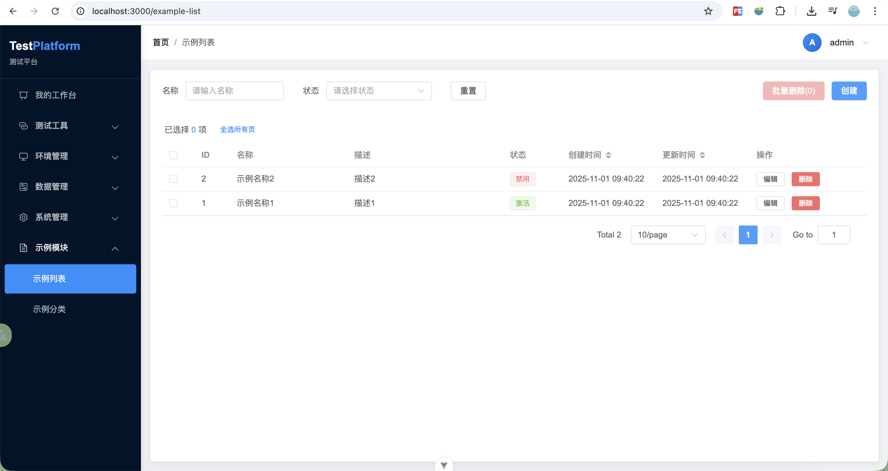
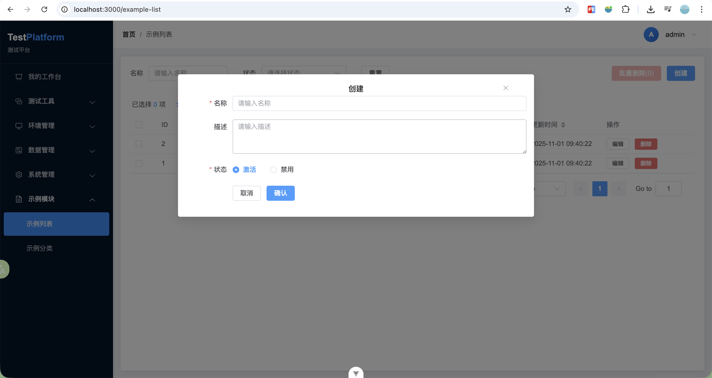

[TOC]

<h1 align="center">test_platform 服务说明文档</h1>


## 1. 后端

- 初始化项目

```
创建目录
mkdir test_platform
cd test_platform
mkdir -p backend/app

创建虚拟环境
python3 -m venv .venv

激活虚拟环境
source .venv/bin/activate
```

- 创建 `requirements.txt`
  - 安装依赖 `pip install flask flask-sqlalchemy flask-migrate flask-cors flask-restful`
  - 将依赖列表写入文件 `pip freeze > backend/requirements.txt`
  - 安装依赖 `pip install -r requirements.txt`
- 创建配置文件 `backend/config.py`
- 创建 `backend/app/__init__.py`
- 创建数据库模型 `backend/app/models/example_model.py`
- 创建业务层 `backend/app/services/example_service.py`
- 创建模块 API 路由 `backend/app/routes/example_routes.py`
- 创建启动脚本 `backend/main.py`

初始化数据库 

```
export FLASK_APP=app.routes:create_app

# 初始化数据库
rm -rf migrations/
flask db init
flask db migrate -m "Initial migration"

# 仅更新
flask db upgrade

# 删除所有表
flask db downgrade base
```


## 2. 前端

- 初始化项目

```
npm init vue@latest frontend
cd frontend
npm install element-plus axios vue-router pinia
```

- 配置项目 `frontend/vue.config.js`
- 创建路由 `frontend/src/router/index.js`
- 创建 `frontend/src/services/exampleService.js`
- 创建 `frontend/src/stores/exampleStore.js`
- 创建项目组件列表 `frontend/src/views/ExampleView.vue`
- 启动项目 `npm run dev`
  
```text
Views/Components → Stores → Services → Backend API
       ↓              ↓          ↓
   用户交互       状态管理    网络请求
```


## 3. 测试

- 查询接口

```
查询所有
curl -X GET "http://localhost:5001/api/examples"

分页查询
curl -X GET "http://localhost:5001/api/examples?page=1&per_page=10"

获取单个 example 数据
curl -X GET "http://localhost:5001/api/examples/1"
```

- 新增接口

```
curl 'http://localhost:5001/api/examples' \
  -H 'Content-Type: application/json' \
  --data-raw '{"name":"示例名称","description":"","status":"active"}'
```

- 更新接口

```
curl -X PUT "http://localhost:5001/api/examples/1" \
-H "Content-Type: application/json" \
  --data-raw '{"name":"更新示例名称","description":"","status":"active"}'
```

- 删除接口

```
curl -X DELETE "http://localhost:5001/api/examples/1"
```

列表页面



新增 example 接口页面




## 4. 部署

Docker 部署文件  
[backend/Dockerfile](backend/Dockerfile)  
[frontend/Dockerfile](frontend/Dockerfile)  
[docker-compose.yml](docker-compose.yml)  

封装启动脚本 [start.sh](start.sh)

```bash
# 删除服务
docker-compose stop example_backend example_frontend
docker-compose rm -f example_backend example_frontend

# 启动服务
docker-compose up --build -d backend frontend
```
